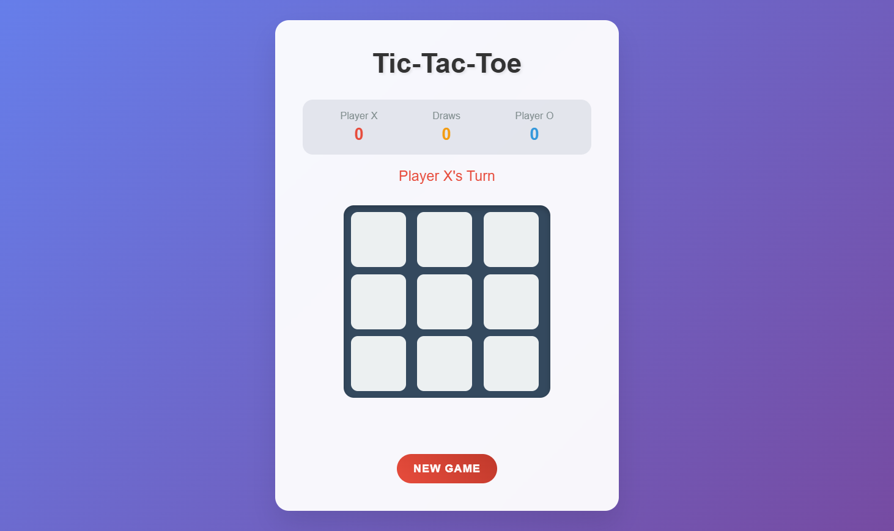

# 🎮 Tic-Tac-Toe Game



## 📌 Project Overview
The Tic-Tac-Toe Game is a responsive, visually engaging, and interactive web-based project built using HTML, CSS, and JavaScript. It features a beautiful UI, real-time gameplay, score tracking, and winning/draw detection.

The project runs entirely on the browser and doesn't require any backend or installation — perfect for beginners to learn DOM manipulation, event handling, and game logic.

## 🚀 Features

### 🎲 Interactive Gameplay
✔ Play in turns as Player X and Player O  
✔ Responsive board with smooth animations

### 📈 Score Tracking
✔ Persistent score tracking for Player X, Player O, and Draws  
✔ Stylish scoreboard UI

### 🏆 Winning Logic
✔ Automatically detects winning combinations  
✔ Highlights winning cells with animations

### 🧠 Draw Detection
✔ Identifies when the game ends in a draw  
✔ Displays friendly draw message

### 🌀 Beautiful UI
✔ Fully responsive layout  
✔ Smooth transitions and animated elements  
✔ Mobile-friendly and elegant design

### 🔁 Reset Functionality
✔ Start a new game with one click  
✔ Board and status reset while retaining score

## 🛠️ Installation & Setup

### 📋 Prerequisites
- Any modern web browser (Chrome, Edge, Firefox, Safari)
- Text editor (VSCode, Sublime, etc.) – optional for editing

### 📥 Clone the Repository
```bash
git clone https://github.com/YOUR_GITHUB_USERNAME/TicTacToeGame.git
cd TicTacToeGame
```

### ▶️ Run the Project
Simply open index.html in your browser:
```
Right Click → Open with → Browser
```

## 📂 Project Structure
```
TicTacToeGame/
│── index.html        # Main HTML file with game logic
│── README.md         # Project documentation
```

## 📜 How the Game Works

### 🔹 Game Start
- Player X always starts
- Players click cells to make their move

### 🔹 Turn Alternation
- Alternates turn between X and O after each move
- Shows current player's turn

### 🔹 Win Condition
- Checks all rows, columns, and diagonals after each move
- Highlights winning line and displays the winner

### 🔹 Draw Condition
- If all cells are filled without a win, game ends in draw

### 🔹 New Game
- Clicking New Game clears board but keeps scores

## 🏗️ Future Enhancements
🔹 Add Multiplayer Online Feature  
🔹 Add Sound Effects and Background Music  
🔹 Add AI Opponent using Minimax Algorithm  
🔹 Dark Mode Toggle

## 🏆 Why Use This Project?
✅ Easy to Use & Play  
✅ Fully Responsive & Animated  
✅ Beginner-Friendly Code  
✅ No External Dependencies  
✅ Great Project to Learn JavaScript Game Logic

## 🤝 Contributing
We welcome contributions! To contribute:

1. Fork the repository
2. Create a new branch (feature-somethingCool)
3. Commit your changes
4. Push the branch
5. Open a Pull Request

## 📞 Contact
For questions, feedback, or suggestions:

📧 **Email:** swarup8125@gmail.com  
🔗 **GitHub:** [Chennuru Swarup](https://github.com/swarup79997/)
